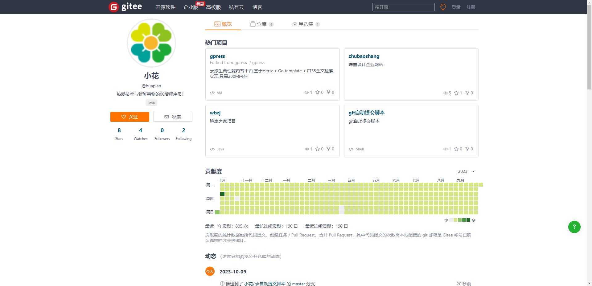

git自动提交
=======

##### 前言

看着git空白的提交记录心里很不舒服,想着能不能弄个定时任务部署到服务器上自动提交然后研究研究就搞了一版这个供大家参考

设计思路是 用java项目的定时任务来执行修改文本和提交代码的脚本

### 操作步骤

1. java程序
   可以部署到自己的博客或者单独起一个空的springboot项目(我是在博客里边加的定时任务)

2. 拉取代码
   将代码fork到你的git仓库 
   然后把代码在liunx服务器上指定文件夹下git clone下来 然后给脚本赋予执行权限

3. 修改java程序中 这个脚本的实际位置 /www/project/blog/gitAutoCom

4. 编码完毕将java项目部署到服务器

5. 5分钟提交一次 可以看java服务的日志打印执行结果

   ```sh
   开始执行脚本了........2022-10-12 15:45:00
   [From https://gitee.com/huapian/gitAutoCom,  * branch            master     -> FETCH_HEAD, Already up-to-date., [master 3f9039b] 自动提交:2022-10-12 15:45:00,  1 file changed, 1 insertion(+), remote: Powered by GITEE.COM [GNK-6.4], To https://gitee.com/huapian/gitAutoCom.git,    f7a517b..3f9039b  master -> master]
   脚本执行完了........2022-10-12 15:45:03
   ```

   

### 上代码

#### 定时任务代码

springboot的定时任务,可以选其他的定时任务适合项目的即可(windows环境下脚本也可执行,可添加计划任务不用部署到服务器也可定时提交git)

    @Scheduled(cron = "0 0/5 * * * ?")  
    public void timerSubmit() throws Exception {  
        System.out.println("开始执行脚本了........"+ DateUtils.getTime());  
        System.out.println("执行结果:"+CmdUtils.execCmd("cd /www/project/blog/gitAutoCom && ./git.sh"));  
        System.out.println("脚本执行完了........"+ DateUtils.getTime());  
    }  

#### 执行cmd命令的工具类[CmdUtils](https://github.com/huapian/gitautosubmit/blob/master/CmdUtils.java "CmdUtils")

#### 提交脚本[git.sh](https://github.com/huapian/gitautosubmit/blob/master/git.sh "git.sh")

------


### 遇到的问题

##### 在linux上发现每次git push都需要输入用户名和密码，设置全局的都没有用

- 解决:直接用以下的命令即可 (使用此命令后还会需要输入一次用户名和密码，但是下一次就不需要了)

  `git config --global credential.helper store`

##### 权限问题 ./git.sh: Permission denied

- 解决: 拉取代码后需要给git.sh执行权限 否则脚本无法执行
    `chmod -R 755 git.sh`


提供其他版本的实现思路

- 使用liunx定时任务来执行定时任务
- 使用win计划任务来执行定时推送时脚本


## 不再自动更新  页面已满


